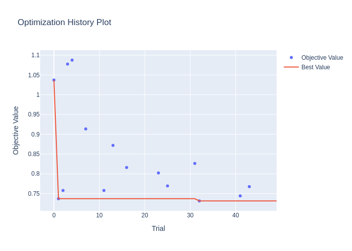
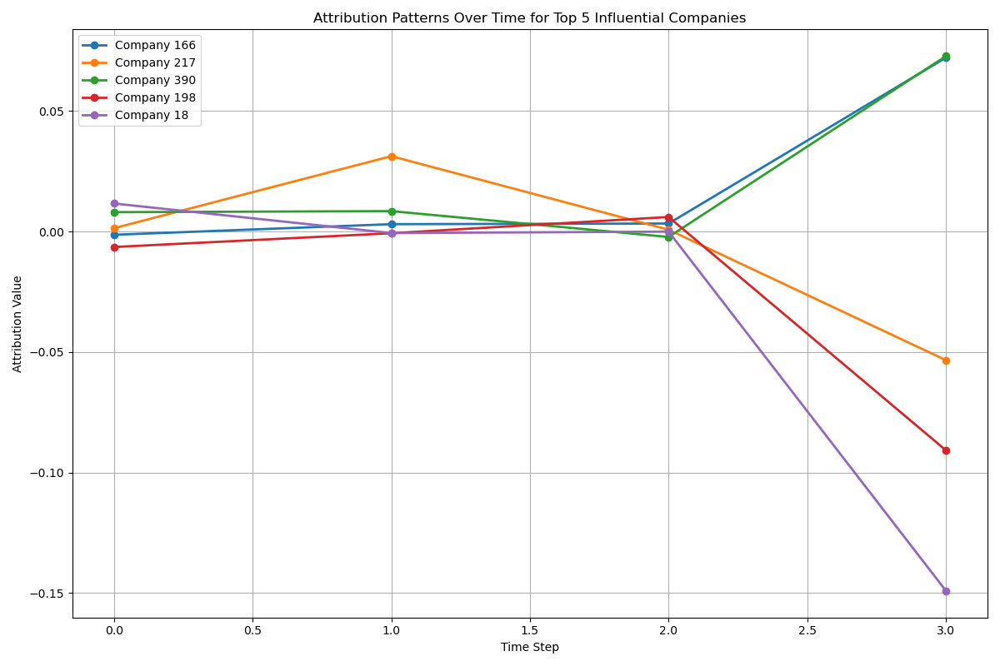

# LSTM Stock Market Prediction
> COMPSCI5103 Deep Learning For MSc (M) - 2024-25

This coursework applies deep learning techniques to forecast daily percentage movements in stock prices for 442 companies using historical market data from 2010 to 2022. The model leverages **LSTM networks** to capture temporal dependencies, with hyperparameter optimization via [**Optuna**](https://optuna.org/) and model interpretability through [**Captum**](https://captum.ai/).

## Coursework Overview
Objective: Predict stock price percentage movement for 442 companies on April 1st, 2022, based on historical daily movements from 05/04/2010 to 31/03/2022.

[Jupyter Notebook](./LSTM-Stock-Market-Prediction.ipynb)

* Data Engineering:
    * Parsed and preprocessed historical stock percentage data.
    * Normalized and windowed time series for supervised learning.
* Model Development:
    * Implemented LSTM models using PyTorch.
    * Tuned number of layers, hidden units, learning rates, etc., via Optuna.
    * Final predictions generated for April 1st, 2022.
* Evaluation and Submission:
    * Model performance validated using Mean Squared Error (MSE).
    * Best model yielded a Kaggle public leaderboard MSE: 2.52854.
* Model Interpretation:
    * Captum used to evaluate feature importance in time series sequences.
    * Identified temporal patterns and influential time steps in prediction logic.

## Selected Outputs

Optuna Optimization History Plot

- Efficient hyperparameter search led to significant MSE improvement.
- Tuned parameters: LSTM layers, hidden size, dropout rate, learning rate.

See: [study_statistics.txt](./study_statistics.txt) for detailed values.

Captum Attribution Analysis

- Temporal saliency maps identified recent days as most influential for predicting next-day movements.
- Interpretation revealed consistent model attention patterns across sectors.

## Feedback

> Excellent notebook structure and graphics for EDA, optimization and interpretation!

* You successfully split the original training dataset into a training and validation dataset so you could get an unbiased estimator of MSE loss - excellent. [score = 1 / 1] 
* You did very good Optuna hyperparameter optimization to find optimal hyperparameters - excellent. [score = 1.0 / 1]
* You used the validation dataset in the Optuna optimization which is excellent. [score = 1.0 / 1]
* You did captum interpretation analysis where you discovered something about your model - excellent ! [score = 2 / 2]
* You had generally good code comments and markup including discussion sections of Notebook markup. [score = 2 / 2]

Notebook mark: 7.0 / 7

Kaggle MSE Score: 2.52854 which gives kaggle mark of 7 / 7

**Final Overall Mark: 14.0 / 14 = 100%**
